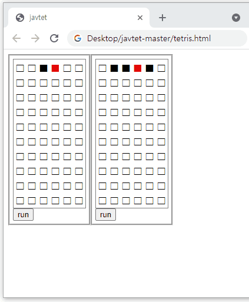

# JavTet
Minimalistic Tetris game runs on a web browser.

## Usage
Are you working on a machine where where you can't install or run unauthorized programs but still want to chill out? Here are small gadget of your favor! Just open `tetris.html` with your browser and go, little tetris game for you!

## How to play


made with [ScreenToGif](https://www.screentogif.com/)

Clicking on run/pause button lets the game start (separately).
By default, there are two game panel presented. Left panel is operated with `w a s d c v`. Use `i j k l , .` for right panel.
Compete with your colleague on single keyboard!
To reset the games, just F5 to reload the page.

## How to configure
Edit the `tetris.html` file with notepad.
Under `<body>/<script>` section there are code creating `Board` objects.
```
Board(width, height, keymap)
```
You can configure its arguments to your flavor.
Note that values used in `keymap` is not ascii but `event.keyCode`.
[Keycode table](https://developer.mozilla.org/en-US/docs/Web/API/KeyboardEvent/keyCode) might come handy.

Also you can add more `Board` creation code to get more than 2 game panels.

## TODO list
- configurable game step duration
- score system
- refactor for smaller & faster code
- net standard compatibility
